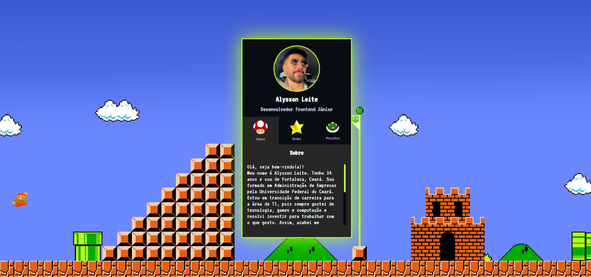

# Projeto Mini-portfólio
> Projeto de um mini-portfólio feito na Mapa Dev Week dos gêmeos Ricardo e Cadu, do Dev em Dobro.
## Índice
- [Imagem do projeto](#imagem-do-projeto)
- [Repositório do projeto](#repositório-do-projeto)
- [Tecnologias 💻](#tecnologias-💻)
- [O que aprendi 👨🏻‍💻](#o-que-aprendi-👨🏻‍💻)
- [Contato 📩](#contato-📩)

## Imagem do projeto

Projeto feito tomando como base o da Mapa Dev Week realizada em Outubro/22. Adicionei animações e uma aba a mais com 'projetos'. Além disso dei uma cara original, com gifs e background do jogo Super Mario.

## Repositório do projeto
[🔗 Clique aqui para acessar o projeto](https://github.com/alysson-leite/mini-portfolio)

## Tecnologias 💻
- HTML
- CSS
- JavaScript
- Git e Github

## O que aprendi 👨🏻‍💻
Neste projeto aprendi a utilizar melhor as animações em CSS. Além de também ter aperfeiçoado o conhecimento de eventos em Javascript, como o 'addEventListener'.

## Contato 📩
[alysson_leite@yahoo.com.br](alysson_leite@yahoo.com.br)

[Linkedin](https://www.linkedin.com/in/alysson-leite-14040a239/)

[Github](https://github.com/alysson-leite)